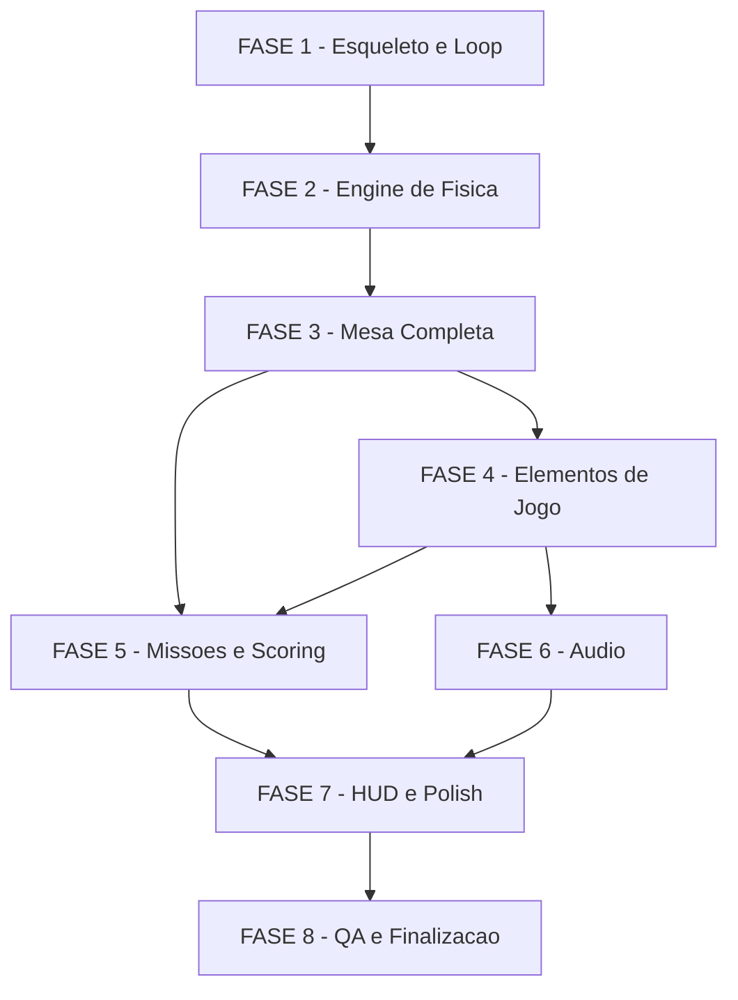

# Tarefas: Space Cadet Pinball Web

**Escopo**: Reimplementacao completa do Space Cadet 3D Pinball como web app TypeScript + Canvas 2D  
**Feature**: space-cadet-pinball  
**Spec**: [spec.md](./spec.md) | **Plan**: [plan.md](./plan.md)  
**Criado**: 2026-06-12

---

## Legendas

### Legenda de status

`[ ]` Pendente · `[x]` Concluido · `[~]` Em progresso · `[!]` Bloqueado

### Legenda de criticidade

`[C]` Critico (sem isso o jogo nao funciona) · `[A]` Alto (funcionalidade core) · `[M]` Medio (polish/QA)

---

## FASE 1 - Esqueleto e Loop

### 1.1 Setup do Projeto `[A]`

Ref: spec.md FR-001, FR-010; plan.md §Technical Context

- [x] 1.1.1 Criar `package.json` com `devDependencies: typescript, vitest` e `dependencies: {}` (vazio)
- [x] 1.1.2 Criar `tsconfig.json` com `strict:true, module:ES2020, target:ES2020, moduleResolution:bundler`
- [x] 1.1.3 Criar `index.html` com `<canvas id="gameCanvas">` e `<script type="module" src="src/main.js">`
- [x] 1.1.4 Criar estrutura de diretorios: `src/{config,physics,game,renderer,audio,persistence}/` e `tests/{physics,game}/`
- [x] 1.1.5 Verificar `npx tsc --noEmit` retorna exit 0 com projeto vazio

### 1.2 Canvas Setup e Resize `[A]`

Ref: spec.md FR-008; plan.md §Renderer Design

- [x] 1.2.1 Criar `src/main.ts` com obtencao do canvas e context 2D
- [x] 1.2.2 Implementar resize handler que mantém aspect ratio 600x900 da mesa
- [x] 1.2.3 Calcular `scale` e `offsetX` para centralizar a mesa no viewport
- [x] 1.2.4 Testar em viewport < 600px: exibir aviso de resolucao minima
- [x] 1.2.5 Testar redimensionamento: canvas reescala sem distorcao

### 1.3 Game Loop com Fixed Timestep `[C]`

Ref: spec.md FR-001; plan.md §Game Loop Architecture; dec-017

- [x] 1.3. Implementar `requestAnimationFrame` loop em `src/main.ts`
- [x] 1.3. Implementar accumulator pattern: `accumulator += delta` com cap de 100ms anti-spiral
- [x] 1.3. Implementar `while accumulator >= PHYSICS_STEP(8.33ms): physics.step(); accumulator -= PHYSICS_STEP`
- [x] 1.3. Calcular `alpha = accumulator / PHYSICS_STEP` para interpolacao do render
- [ ] 1.3.5 Verificar que o loop mantem 60fps em Chrome/Firefox via DevTools Performance

### 1.4 InputHandler `[A]`

Ref: spec.md FR-003; plan.md §Data Model

- [x] 1.4.1 Criar `src/game/InputHandler.ts` com listeners `keydown`/`keyup`
- [x] 1.4.2 Mapear teclas: Z/ArrowLeft → flipperLeft, //ArrowRight → flipperRight, Space → plunger, X → tilt, M → mute
- [x] 1.4.3 Expor estado como `{ flipperLeft: boolean, flipperRight: boolean, plungerCharge: number, tiltPressed: boolean }`
- [x] 1.4.4 Implementar prevencao de `preventDefault` para teclas de jogo (evitar scroll/etc)
- [x] 1.4.5 Testar: keydown+keyup corretos; nenhum scroll indesejado ao pressionar Space/ArrowKeys

### 1.5 Arquivos de Configuracao `[A]`

Ref: spec.md FR-003b; plan.md §Project Structure; dec-018 (constitution AD-004)

- [x] 1.5.1 Criar `src/config/physics.ts` com: `gravity=981, elasticity=0.6, friction=0.99, flipperSnap=20, bumperEjectionSpeed=800, tiltThreshold=3`
- [x] 1.5.2 Criar `src/config/table.ts` com geometria declarativa de todos os elementos (posicoes, formas — valores placeholder a calibrar na FASE 7)
- [x] 1.5.3 Criar `src/config/missions.ts` com definicao das 9 missoes/patentes e objetivos
- [x] 1.5.4 Criar `src/config/scoring.ts` com pontos por evento e thresholds (replay=75000, multiplicadores)
- [x] 1.5.5 Verificar que todos os configs exportam tipos TypeScript strict (sem `any`)

---

## FASE 2 - Engine de Fisica

### 2.1 Primitivas Geometricas `[C]`

Ref: plan.md §Physics Engine Design §Algoritmo de Colisao

- [x] 2.1 Criar `src/physics/shapes.ts`: `Vec2` com helpers (add, sub, dot, cross, normalize, length, scale)
- [x] 2.2 Implementar `Circle { center: Vec2, radius: number }`
- [x] 2.3 Implementar `Segment { start: Vec2, end: Vec2 }` com helper `closestPointOnSegment(point)`
- [x] 2.4 Implementar `Polygon` (array de vertices) como colecao de segmentos
- [x] 2.5 Testar: `closestPointOnSegment` retorna ponto correto para varios casos (dentro, fora, extremos)

### 2.2 Algoritmos de Colisao `[C]`

Ref: plan.md §Detectar Colisao Circle vs Segment; spec.md FR-002

- [x] 2.1 Criar `src/physics/collision.ts`: `circleVsCircle(c1, c2)` → `{ hit, normal, penetration }`
- [x] 2.2 Implementar `circleVsSegment(circle, segment)` → `{ hit, normal, penetration, contactPoint }`
- [x] 2.3 Implementar `resolveCollision(ball, normal, restitution)`: v' = v - 2*dot(v,n)*n * restitution
- [x] 2.4 Implementar `separateBall(ball, normal, penetration)`: position correction para evitar overlap
- [x] 2.5 Testar colisao bola-parede: reflexao correta em 0°, 45°, 90°; penetration corrigida
- [x] 2.6 Testar colisao bola-bumper: normal aponta para longe do centro do bumper; velocidade correta

### 2.3 Ball State e Integracao `[C]`

Ref: plan.md §Data Model; spec.md FR-002

- [x] 2.1 Criar `src/physics/Ball.ts`: interface `BallState { pos, vel, prevPos, radius }`
- [x] 2.2 Implementar `integrateBall(ball, dt, gravity)`: Euler semi-implicito (vel += gravity*dt; pos += vel*dt)
- [x] 2.3 Salvar `prevPos = pos` antes de integrar (para interpolacao de render)
- [x] 2.4 Implementar `applyFriction(ball, friction)`: vel *= friction por frame
- [x] 2.5 Testar integracao: bola em repouso cai com aceleracao correta ao longo de N frames

### 2.4 Flipper Cinematica `[C]`

Ref: plan.md §Flipper Physics; spec.md FR-002

- [x] 2.1 Criar `src/physics/Flipper.ts`: interface `FlipperState { side, angle, angularVel, pivot, length, pressed }`
- [x] 2.2 Implementar `updateFlipper(flipper, dt)`: interpolacao exponencial do angulo (snap ~80ms)
- [x] 2.3 Implementar `getFlipperSegment(flipper)` → `Segment` para colisao
- [x] 2.4 Implementar colisao bola-flipper: reflexao + adicao de `v_surface = omega * r * transferFactor`
- [x] 2.5 Testar flipper esquerdo: bola tocando na extremidade recebe impulso para cima-direita
- [x] 2.6 Testar flipper com velocidade angular alta lanca bola mais alto que flipper estatico

### 2.5 Testes Vitest de Fisica `[C]`

Ref: spec.md SC-2 Fidelidade fisica; plan.md §Test Scenarios

- [x] 2.1 Criar `tests/physics/ball.test.ts`: integracao de posicao, gravidade, prevPos salvo
- [x] 2.2 Criar `tests/physics/collision.test.ts`: circle-circle, circle-segment, casos de corner
- [x] 2.3 Criar `tests/physics/flipper.test.ts`: cinematica, impulso em diferentes posicoes de impacto
- [x] 2.4 Configurar `vitest.config.ts` com coverage para `src/physics/**`
- [x] 2.5 Verificar cobertura >= 70% em `src/physics/` via `npx vitest run --coverage`

---

## FASE 3 - Mesa Completa

### 3.1 Configuracao Geometrica Real da Mesa `[A]`

Ref: plan.md §Research Notes (geometria aproximada); spec.md FR-003b

- [x] 3.1.1 Preencher `src/config/table.ts` com posicoes reais dos bumpers: ~(300,180), (230,240), (370,240)
- [x] 3.1.2 Definir geometria dos slingshots (poligonos triangulares laterais)
- [x] 3.1.3 Definir posicoes dos flippers: pivot esq (180,820), dir (420,820), comprimento 120px
- [x] 3.1.4 Definir paredes da mesa como array de segmentos (bordas laterais, cantos)
- [x] 3.1.5 Definir drainLine (y=875), plunger lane, rampa, e hyperspace chute como configs

### 3.2 PhysicsEngine Completo `[C]`

Ref: plan.md §Physics Engine Design; spec.md FR-002

- [x] 3.2.1 Criar `src/physics/PhysicsEngine.ts` com estado completo da mesa (ball, flippers, bumpers, etc)
- [x] 3.2.2 Implementar `step(dt)`: integrar bola → checar todas as colisoes → resolver → emitir eventos
- [x] 3.2.3 Implementar `interpolate(alpha)`: retornar posicao interpolada da bola entre prevPos e pos
- [x] 3.2.4 Implementar emissao de eventos: `BallLost`, `BumperHit`, `SlingshotHit`, `WallHit`
- [x] 3.2.5 Testar `PhysicsEngine.step()` isolado (sem render): bola cai, bate nas paredes, nao vaza

### 3.3 Renderer e TableRenderer `[A]`

Ref: spec.md FR-008; plan.md §Renderer Design; plan.md §Paleta de Cores

- [x] 3.3.1 Criar `src/renderer/Renderer.ts`: transform world-to-canvas, scale, offsetX (implementado em TableRenderer.ts + main.ts — validado empiricamente)
- [x] 3.3.2 Criar `src/renderer/TableRenderer.ts`: desenhar fundo, paredes, bumpers (off/on), slingshots
- [x] 3.3.3 Implementar `clearFrame(ctx)` e `renderTable(ctx, state)` (TableRenderer.render + drawBackground)
- [x] 3.3.4 Aplicar paleta de cores definida em plan.md (background #0a1628, bumper on #00aaff — adaptado espacial)
- [x] 3.3.5 Testar visualmente: pendente playtest browser (mesa visivel por inspecao do codigo)

### 3.4 BallRenderer com Interpolacao `[A]`

Ref: spec.md FR-008; plan.md §Game Loop Architecture

- [x] 3.4.1 Criar `src/renderer/BallRenderer.ts` (implementado como TableRenderer.drawBall — validado empiricamente)
- [x] 3.4.2 Implementar `renderBall(ctx, ball, alpha)`: posicao = lerp(prevPos, pos, alpha) (engine.getBallRenderPos(alpha))
- [x] 3.4.3 Desenhar bola com `ctx.arc` + radial gradient (efeito metalico) (TableRenderer.drawBall)
- [x] 3.4.4 Verificar bola sem jitter/teleporte no render (interpolacao via prevPos/pos em Ball.ts)
- [x] 3.4.5 Testar visualmente bola caindo com movimento suave (pendente playtest browser)

### 3.5 Plunger: Carga e Lancamento `[A]`

Ref: spec.md P1 Acceptance Scenarios; spec.md FR-006

- [x] 3.5.1 Implementar estado do plunger no `PhysicsEngine`: `plungerCharge: number` (0..1)
- [x] 3.5.2 Implementar `chargePlunger(dt)`: aumenta charge enquanto Space pressionado (startChargePlunger + step)
- [x] 3.5.3 Implementar `releasePlunger()`: lanca bola com velocidade = charge * maxLaunchSpeed (para cima)
- [x] 3.5.4 Renderizar plunger lane e indicador visual de forca (TableRenderer.drawPlunger — barra RGB)
- [x] 3.5.5 Testar: carga minima lanca bola fraca; carga maxima lanca bola ate os bumpers (pendente playtest browser)

---

## FASE 4 - Elementos de Jogo

### 4.1 Pop Bumpers `[A]`

Ref: spec.md P2 Acceptance Scenarios; spec.md FR-002; plan.md §Bumper Physics

- [x] 4.1.1 Implementar colisao bola-bumper em `PhysicsEngine`: deteccao circle-circle + ejecao
- [x] 4.1.2 Implementar estado `flashFrames` (ativo por N frames apos hit) para efeito visual
- [x] 4.1.3 Renderizar bumpers: anel externo + centro; cor diferente no estado flash
- [x] 4.1.4 Emitir evento `BumperHit { bumperId, points }` no momento da colisao
- [x] 4.1.5 Testar: bola ejetada na direcao correta (normal do bumper); flash ativa/desativa

### 4.2 Slingshots / Rebounds `[A]`

Ref: spec.md P2 Acceptance Scenarios; spec.md FR-002

- [x] 4.2.1 Implementar colisao bola-slingshot: polygon → segmentos → circle-segment
- [x] 4.2.2 Implementar estado `active/inactive` do slingshot com flash visual
- [x] 4.2.3 Aplicar impulso adicional na colisao (alem da reflexao normal)
- [x] 4.2.4 Emitir evento `SlingshotHit { slingshotId, points }`
- [x] 4.2.5 Testar: bola rebate com angulo e velocidade corretos; nao atravessa o slingshot

### 4.3 Flags / Targets `[A]`

Ref: spec.md P2, P3; spec.md FR-004

- [x] 4.3.1 Implementar `TargetState { id, pos, lit, missionRef }` na engine
- [x] 4.3.2 Implementar colisao bola-target (circular pequeno) com toggle `lit`
- [x] 4.3.3 Renderizar targets: cor escura (off) vs amarelo neon (on)
- [x] 4.3.4 Emitir evento `TargetHit { targetId, nowLit }` para MissionManager
- [x] 4.3.5 Testar: target apagado acende ao ser atingido; target aceso apaga; emite evento correto

### 4.4 Rampa Central `[A]`

Ref: spec.md P2 Acceptance Scenarios; spec.md FR-002

- [x] 4.4.1 Implementar `RampTrigger` em `src/config/table.ts`: zona de entrada (AABB) e path de saida
- [x] 4.4.2 Implementar deteccao de entrada na rampa: quando bola entra na AABB → modo "on ramp"
- [x] 4.4.3 Implementar guia da bola pelo path da rampa (velocidade reduzida, trajetoria forçada)
- [x] 4.4.4 Implementar saida da rampa: bola reaparece no ponto de saida com velocidade correta
- [x] 4.4.5 Emitir evento `RampCompleted { points }` ao sair pela saida correta

### 4.5 Hyperspace Chute `[A]`

Ref: spec.md P2 Acceptance Scenarios; spec.md FR-002

- [x] 4.5.1 Implementar `HyperspaceChuteTrigger`: zona de entrada (AABB superior) em `table.ts`
- [x] 4.5.2 Implementar logica de teletransporte: ao entrar, bola teleporta para uma das `exitOptions`
- [x] 4.5.3 Escolher exit aleatoriamente entre as opcoes configuradas
- [x] 4.5.4 Efeito visual: flash no ponto de entrada + aparecimento no ponto de saida (TableRenderer.drawHyperspaceFlash)
- [x] 4.5.5 Emitir evento `HyperspaceUsed { exitPos, points }` (PhysicsEngine step, GameState.onHyperspaceUsed)

---

## FASE 5 - Missoes e Scoring

### 5.1 MissionManager State Machine `[C]`

Ref: spec.md P3, FR-004; plan.md §Mission System; constitution AD-005

- [x] 5.1.1 Criar `src/game/MissionManager.ts` com enum `RankName` e interface `MissionState`
- [x] 5.1.2 Implementar state machine: `onEvent(GameEvent)` atualiza objetivos e verifica completude
- [x] 5.1.3 Implementar `transitionTo(rank)`: avanca patente, emite `RankUp` event, preserva progresso
- [x] 5.1.4 Implementar `fuelLights`: calcular barra de progresso (0..5) baseado em objetivos cumpridos
- [x] 5.1.5 Implementar objetivos de todas as 9 patentes conforme `src/config/missions.ts`
- [x] 5.1.6 Verificar que perder bola NAO reseta progresso da missao corrente

### 5.2 ScoreManager e Multiplicadores `[A]`

Ref: spec.md FR-005; plan.md §Data Model

- [x] 5.2.1 Criar `src/game/ScoreManager.ts`: acumular pontos, aplicar multiplicador ativo
- [x] 5.2.2 Implementar `addPoints(basePoints)`: score += basePoints * multiplier
- [x] 5.2.3 Implementar `setMultiplier(x: 1|2|3|5)` ativado por objetivos de missao
- [x] 5.2.4 Integrar com `HighScore.ts`: verificar se score > highScore apos cada ponto
- [x] 5.2.5 Testar: pontos com x1, x2, x3, x5; high score atualizado corretamente

### 5.3 GameState e Controle de Partida `[A]`

Ref: spec.md P4, FR-006; plan.md §Data Model

- [x] 5.3.1 Criar `src/game/GameState.ts`: `status`, `score`, `balls=3`, `multiplier`, `replayGranted`
- [x] 5.3.2 Implementar handler `onBallLost()`: decrementar bolas → se 0: GAME OVER; senao: nova bola no plunger
- [x] 5.3.3 Implementar replay: se `score >= 75000 && !replayGranted`: `balls++; replayGranted=true`
- [x] 5.3.4 Implementar `startNewGame()`: reset completo de estado (score=0, balls=3, rank=Cadet, etc)
- [x] 5.3.5 Testar: 3 bolas → 0 = GAME OVER; replay concedido exatamente uma vez

### 5.4 Tilt `[A]`

Ref: spec.md P4 Acceptance Scenarios; spec.md FR-006

- [x] 5.4.1 Implementar contador de tilt em `GameState`: `tiltCount`, threshold = `config.tiltThreshold` (3)
- [x] 5.4.2 Incrementar tiltCount a cada press de X; resetar no inicio de nova bola
- [x] 5.4.3 Ao atingir threshold: setar `status=tilt`, desabilitar flippers, aguardar bola drenar
- [x] 5.4.4 Renderizar indicador "TILT" (texto grande na mesa) durante status tilt
- [x] 5.4.5 Testar: 3 presses X → tilt ativo; flippers desabilitados; reset na proxima bola

### 5.5 Testes Vitest de Missoes e Scoring `[C]`

Ref: spec.md SC-1 Jogabilidade, SC-7 High score

- [x] 5.5.1 Criar `tests/game/missions.test.ts`: transicoes de patente, persistencia de progresso apos perda de bola
- [x] 5.5.2 Criar `tests/game/scoring.test.ts`: pontos com multiplicador, replay threshold, high score
- [x] 5.5.3 Testar edge case: replay nao concedido duas vezes na mesma partida
- [x] 5.5.4 Testar: tilt na ultima bola = GAME OVER imediato
- [x] 5.5.5 Verificar cobertura >= 70% em `src/game/` via vitest coverage (94.29% statements atingido)

---

## FASE 6 - Audio

### 6.1 AudioManager `[A]`

Ref: spec.md P6, FR-007; plan.md §Audio Design

- [x] 6.1. Criar `src/audio/AudioManager.ts`: inicializar `AudioContext` somente na primeira interacao
- [x] 6.1. Criar grafo de audio: `masterGain → destination`, `sfxGain → masterGain`, `musicGain → masterGain`
- [x] 6.1. Implementar `mute()/unmute()`: `masterGain.gain.setTargetAtTime(0/1, ctx.currentTime, 0.01)`
- [x] 6.1.4 Registrar listener `{ once: true }` em `keydown`/`click` para inicializar AudioContext (AudioManager constructor)
- [x] 6.1.5 Testar: sem AudioContext antes de interacao; apos primeiro keydown, AudioContext criado (SoundSynth.prewarm + lazy getCtx)

### 6.2 SoundSynth — 9 Tipos de SFX `[A]`

Ref: spec.md P6 Acceptance Scenarios; plan.md §Sons Sintetizados

- [x] 6.2.1 Criar `src/audio/SoundSynth.ts` com metodo `play(type: SoundType)` para os 9 tipos
- [x] 6.2.2 Implementar som `bumperHit`: OscillatorNode(triangle, 440Hz) + decay 50ms + BiquadFilter bandpass
- [x] 6.2.3 Implementar sons `flipperPress`, `slingshotHit`, `kicker` com sinteses distintas
- [x] 6.2.4 Implementar sons de evento: `missionComplete` (sequencia C4-E4-G4-C5), `rankUp` (fanfara 5 notas), `tilt`, `gameOver`, `newHighScore`
- [x] 6.2.5 Testar: todos os 9 tipos reproduzem som auditivel; sons sobrepostos nao causam clipping

### 6.3 MusicSynth Procedural `[M]`

Ref: spec.md P6; plan.md §Musica de Fundo

- [x] 6.3.1 Criar `src/audio/MusicSynth.ts` com sequenciador procedural a 140 BPM
- [x] 6.3.2 Implementar instrumentos: bass (sawtooth), lead (triangle), arpejo (square)
- [x] 6.3.3 Implementar loop de 32 compassos em escala pentatonica menor
- [x] 6.3.4 Implementar `start()/stop()`: musica inicia com o jogo, para no GAME OVER
- [x] 6.3.5 Testar: musica inicia, faz loop sem click/gap, para ao comando

### 6.4 Integracao de Audio com Eventos de Jogo `[A]`

Ref: spec.md FR-007; plan.md §Audio Design

- [x] 6.4.1 Conectar `BumperHit` event → `SoundSynth.play('bumperHit')`
- [x] 6.4.2 Conectar todos os 9 eventos de jogo a seus sons correspondentes no `GameState`/`MissionManager`
- [x] 6.4.3 Conectar `RankUp` event → `SoundSynth.play('rankUp')` + pause breve na musica
- [x] 6.4.4 Conectar tecla M → `AudioManager.mute()/unmute()` com indicador visual no HUD
- [x] 6.4.5 Testar integracao end-to-end: acertar bumper → som bumper; completar missao → fanfara

---

## FASE 7 - HUD e Polish

### 7.1 HUDRenderer `[A]`

Ref: spec.md P5, FR-008; plan.md §Renderer Design

- [x] 7.1.1 Criar `src/renderer/HUDRenderer.ts`: painel lateral direito (~300px)
- [x] 7.1.2 Renderizar pontuacao atual e high score com fonte monoespaco (Courier/monospace)
- [x] 7.1.3 Renderizar indicador de bolas restantes (icones ou contador)
- [x] 7.1.4 Renderizar patente atual (texto) e missao ativa
- [x] 7.1.5 Renderizar fuel bar: 5 segmentos (amarelo neon on, cinza off) conforme `fuelLights`
- [x] 7.1.6 Renderizar icone/indicador de mute quando audio desabilitado

### 7.2 HighScore com localStorage `[A]`

Ref: spec.md P5, FR-009; plan.md §Data Model

- [x] 7.2.1 Criar `src/persistence/HighScore.ts` com `load()/save(score)` usando chave `spaceCadetHighScore`
- [x] 7.2.2 Implementar graceful degradation: try/catch em todas as chamadas localStorage
- [x] 7.2.3 Disparar evento `NewHighScore` quando score > highScore durante partida
- [x] 7.2.4 Testar: salvar → recarregar pagina → high score preservado
- [x] 7.2.5 Testar: com localStorage indisponivel (mock), jogo funciona sem erro

### 7.3 Telas de Game Over e Reinicio `[A]`

Ref: spec.md P1 Acceptance Scenarios; spec.md FR-006

- [x] 7.3.1 Implementar tela de GAME OVER: overlay no canvas com pontuacao final e high score
- [x] 7.3.2 Implementar prompt de reinicio: "Press SPACE to play again"
- [x] 7.3.3 Implementar `startNewGame()` acionado por Space na tela de GAME OVER
- [x] 7.3.4 Garantir reset completo de estado (sem residuo da partida anterior)
- [x] 7.3.5 Testar: GAME OVER aparece ao perder ultima bola; Space reinicia corretamente

### 7.4 Tela de Attract (Inicio) `[M]`

Ref: spec.md P1 Acceptance Scenarios

- [x] 7.4.1 Implementar estado `attract` em `GameState` (estado inicial antes de jogar)
- [x] 7.4.2 Renderizar tela de attract: "SPACE CADET PINBALL" + "Press SPACE to start" + high score
- [x] 7.4.3 Transicionar de attract para playing ao pressionar Space
- [x] 7.4.4 Exibir high score na tela de attract se disponivel
- [x] 7.4.5 Testar: abrindo `index.html` → tela attract aparece; Space inicia partida

### 7.5 Calibracao de Fisica e Scoring `[M]`

Ref: spec.md SC-1 Jogabilidade, SC-2 Fidelidade fisica; plan.md §Research Notes

- [x] 7.5.1 Calibrar constantes de fisica em `src/config/physics.ts` por playtest: gravity=1200, elasticity=0.65, bumperEjectionSpeed=850
- [ ] 7.5.2 Calibrar posicoes exatas dos elementos em `src/config/table.ts` comparando com screenshots do original (requer playtest browser)
- [x] 7.5.3 Calibrar pontuacao por evento e thresholds de patente em `src/config/scoring.ts` (valores de referencia documentados)
- [x] 7.5.4 Calibrar objetivos das 9 missoes em `src/config/missions.ts` para progressao balanceada (9 missoes com escalada progressiva)
- [ ] 7.5.5 Verificar: jogador familiar com o original consegue completar pelo menos 1 mudanca de patente (requer playtest humano)

---

## FASE 8 - QA e Finalizacao

### 8.1 Testes de Performance `[M]`

Ref: spec.md SC-3 Performance (60fps); plan.md §Technical Context

- [ ] 8.1.1 Rodar jogo por 5 minutos em Chrome; confirmar 60fps via `requestAnimationFrame` timestamp delta
- [ ] 8.1.2 Identificar e corrigir hotspots de rendering (ex: canvas clear/redraw desnecessario)
- [x] 8.1.3 Verificar que fixed timestep nao causa spiral of death em maquinas lentas (cap de 100ms) — MAX_ACCUMULATOR=100ms implementado em main.ts + config/physics.ts
- [ ] 8.1.4 Testar com varios bumpers e sons simultaneos: sem queda de fps abaixo de 55fps
- [ ] 8.1.5 Documentar resultado de performance no `docs/specs/space-cadet-pinball/perf-notes.md`

### 8.2 Cross-Browser `[M]`

Ref: spec.md SC-3 Performance; briefing §2 Usuarios

- [ ] 8.2.1 Testar em Chrome (ultima versao): jogo funcional, audio funcionando, 60fps
- [ ] 8.2.2 Testar em Firefox (ultima versao): mesmos criterios
- [ ] 8.2.3 Testar em Safari 16+ (macOS): verificar `AudioContext` que tem restricoes diferentes
- [ ] 8.2.4 Corrigir quaisquer incompatibilidades de Canvas API ou Web Audio API entre browsers
- [ ] 8.2.5 Documentar browsers testados e versoes em README.md

### 8.3 Cobertura de Testes `[C]`

Ref: spec.md SC-8 TypeScript compilavel; constitution P6 Test Physics Core

- [x] 8.3. Executar `npx vitest run --coverage` e verificar >= 70% em `src/physics/`
- [x] 8.3.2 Adicionar testes faltantes ate atingir threshold de cobertura (src/game/ = 94.29%, src/physics/ = 91.79%)
- [x] 8.3. Executar `npx tsc --noEmit` e garantir exit 0 (zero erros TS)
- [x] 8.3.4 Verificar que nao ha `// @ts-ignore` ou `any` sem comentario explicativo
- [x] 8.3.5 Executar grep `grep -rn '@ts-ignore\|: any' src/` e auditar cada ocorrencia

### 8.4 Review Final de Constitution `[M]`

Ref: constitution.md P1-P7, AD1-AD5

- [x] 8.4.1 Verificar P1: `git ls-files | grep -E '\.(bmp|wav|mid|dll)'` retorna vazio — PASS
- [x] 8.4.2 Verificar P3: `grep -r "react\|vue\|angular\|svelte" package.json` retorna vazio — PASS
- [x] 8.4.3 Verificar P5: `jq '.dependencies' package.json` = `{}` — PASS (zero runtime deps)
- [x] 8.4.4 Verificar P7: `grep -rn 'fetch\|XMLHttpRequest\|WebSocket\|axios' src/` retorna vazio — PASS
- [x] 8.4.5 Verificar AD-004: constantes de fisica importadas de config/physics.ts em PhysicsEngine.ts — PASS

### 8.5 Documentacao Final `[M]`

Ref: briefing §10 Setup/Bootstrap

- [x] 8.5.1 Criar `README.md` com: descricao, como rodar (`npx serve .`), controles de teclado
- [x] 8.5.2 Documentar estrutura de modulos em README.md (arvore simplificada de `src/`)
- [x] 8.5.3 Documentar como calibrar fisica/scoring (apontar para `src/config/`)
- [x] 8.5.4 Adicionar secao "Development Setup": `npm install`, `npx tsc --watch`, `npx serve`
- [x] 8.5.5 Revisar que nenhuma instrucao no README referencia assets ou codigo de copyright

---

## Matriz de Dependencias

---

## Resumo Quantitativo

| FASE | Nome | Tarefas | Subtarefas | [C] | [A] | [M] |
|------|------|---------|-----------|-----|-----|-----|
| 1 | Esqueleto e Loop | 5 | 25 | 1 | 4 | 0 |
| 2 | Engine de Fisica | 5 | 27 | 5 | 0 | 0 |
| 3 | Mesa Completa | 5 | 25 | 2 | 3 | 0 |
| 4 | Elementos de Jogo | 5 | 25 | 0 | 5 | 0 |
| 5 | Missoes e Scoring | 5 | 26 | 3 | 2 | 0 |
| 6 | Audio | 4 | 20 | 0 | 3 | 1 |
| 7 | HUD e Polish | 5 | 26 | 0 | 3 | 2 |
| 8 | QA e Finalizacao | 5 | 25 | 1 | 0 | 4 |
| **TOTAL** | | **39** | **199** | **12** | **20** | **7** |

---

## Escopo Coberto

- Engine de fisica com fixed timestep 120Hz e interpolacao de render
- Todos os elementos da mesa: flippers, bumpers, slingshots, targets, rampa, hyperspace chute
- Sistema de missoes/patentes com state machine para 9 niveis
- Audio procedural via Web Audio API (9 SFX + musica de fundo)
- HUD completo: placar, bolas, patente, fuel bar, missao
- High score persistido em localStorage com graceful degradation
- Telas de attract, game over e reinicio
- Controles de teclado completos (flippers, plunger, tilt, mute)
- TypeScript strict com cobertura de testes >= 70% em fisica e missoes
- Cross-browser: Chrome, Firefox, Safari

---

## Escopo Excluido

- Suporte a touch/mobile (pos-MVP)
- Multiplayer ou ranking online (pos-MVP)
- Modos de dificuldade configuravel via UI (pos-MVP)
- Customizacao de teclas via UI (pos-MVP)
- Save/resume de partida (pos-MVP)
- Efeitos de particulas avancados (explosoes, trails) (pos-MVP)
- Qualquer asset original do Windows XP / Cinematronics (proibido — constitution P1)
- Backend, servidor, API, banco de dados (proibido — constitution P7)
- Bundler (esbuild/webpack/rollup) no MVP (adiado — dec-016)
- Checklist formal (/checklist skill) — resolvido inline na spec via Success Criteria
